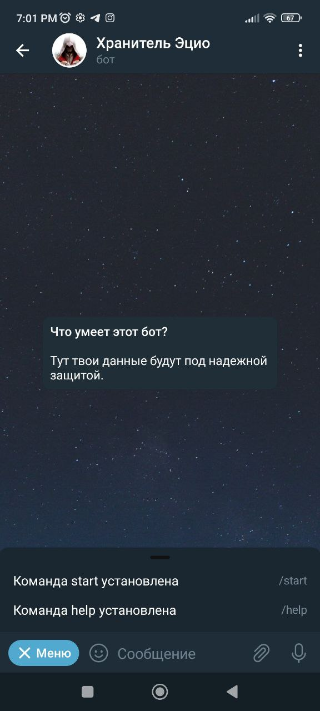
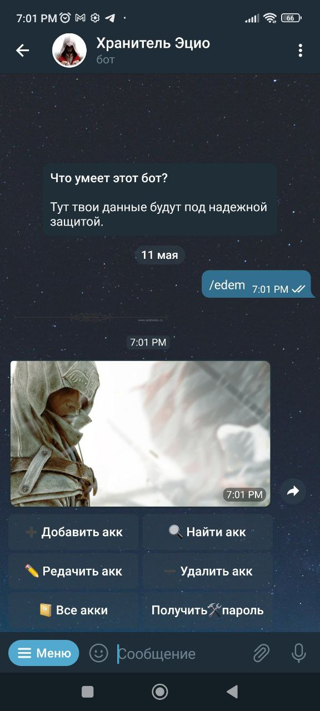
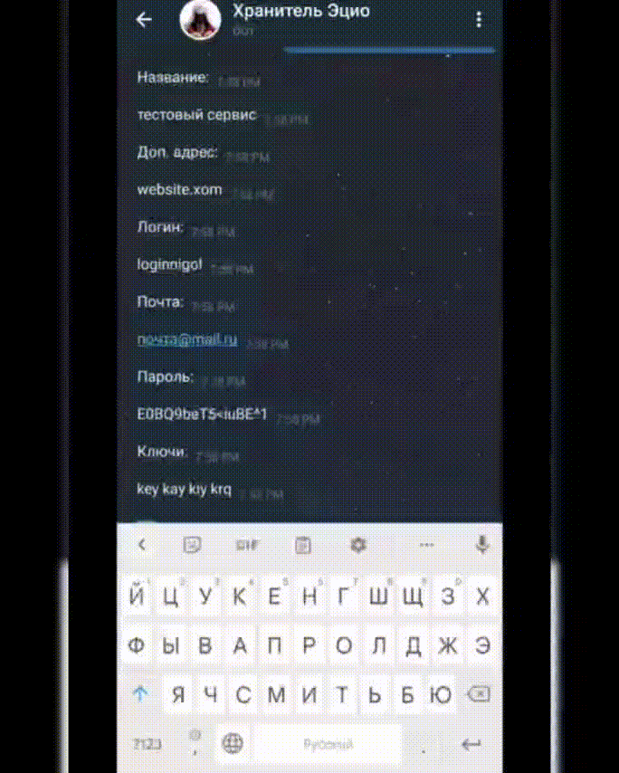

<p align="center">
  
</p>

# Telegram password manager bot

Бот разработан в обучающих целях и не рекоммендован для хранения настоящих данных.


## Функционал бота

|                |                             |
| -------------  | --------------------------- |
| Поиск          | Добавление аккаунта         |
| Редактирование | Формирование таблицы данных |
| Удаление       | Генерация пароля            |  

Для управления используются inline-кнопки. Все пароли и данные пользователя хранятся в таблицах <b>SQLite</b>. Написан на python с исспользованием библиотеки <b>aiogram</b>.
<p align="center">
    
    
    
</p>

## Демонстрация

<p align="center">
    
    
    <br>Основное меню _____________________ Генерация таблицы данных
</p>

## Тест-драйв

Можете скачать и протестировать работу. Для этого измените данные в <b>data/config.ini</b>

```bash
{
    "token": "TOKEN",
    "admins": "id_1 id__2 id_3"
}
```


## Файлы для деплоя
При деплое необходимо обновить runtime.txt до последней версии [python](https://www.python.org/).
 - [Все зависимости лежат тут](https://github.com/jonotyan/telegram-password-manager/blob/main/requirements.txt)
 - [Procfile](https://github.com/jonotyan/telegram-password-manager/blob/main/Procfile)
 - [Runtime](https://github.com/jonotyan/telegram-password-manager/blob/main/runtime.txt)


## Автор

- [@jonotyan](https://www.github.com/jonotyan)

